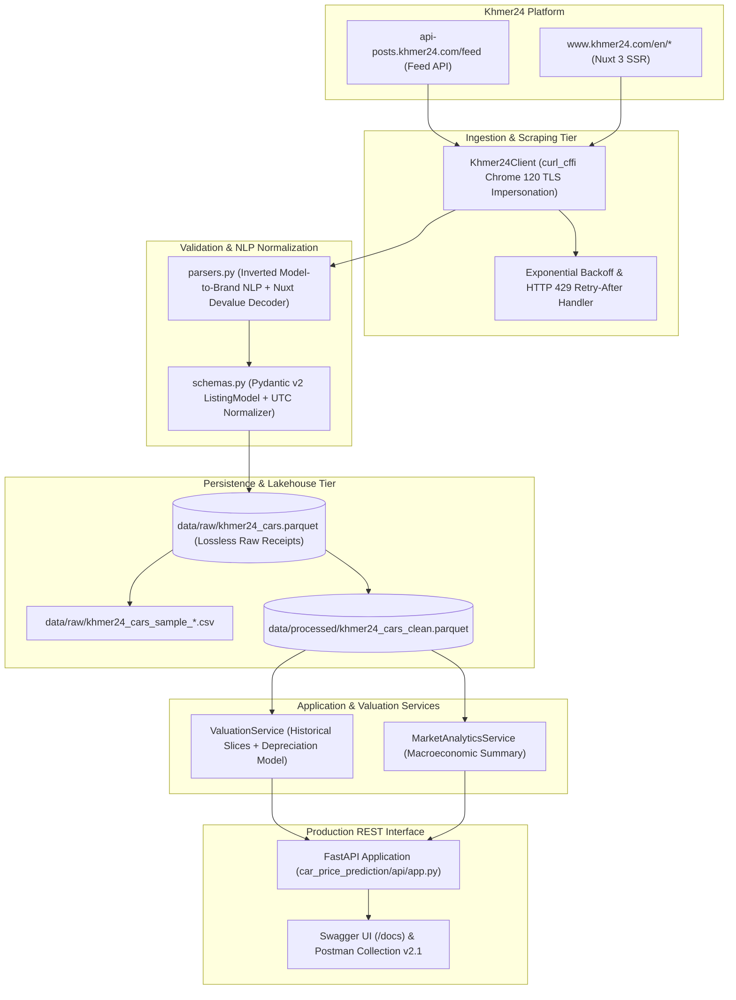
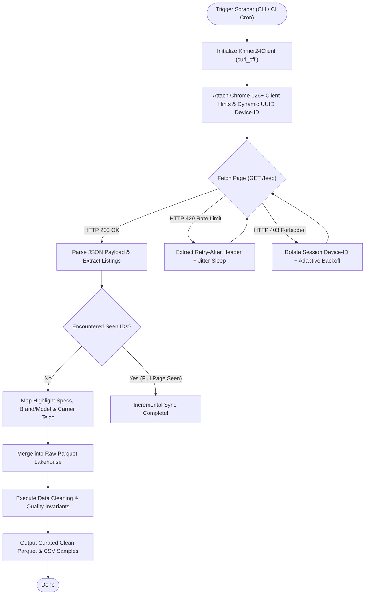
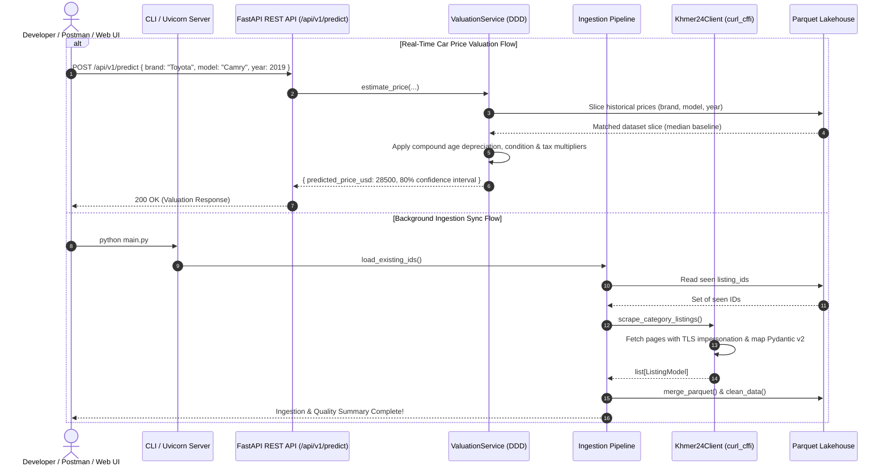

# 🚗 Cambodia Car Price Prediction & Market Intelligence Engine

[](https://www.python.org/downloads/)
[](https://docs.astral.sh/uv/)
[](https://fastapi.tiangolo.com)
[](https://docs.pydantic.dev/latest/)
[](https://github.com/astral-sh/ruff)
[](https://mypy-lang.org/)
[](https://docs.pytest.org/)
[](https://www.docker.com/)

A production-grade automotive data engineering, market valuation, and price prediction platform tailored for Cambodia's vehicle market. It scrapes live listings from **Khmer24**, enforces Domain-Driven Design (DDD) validation contracts, persists lossless Parquet lakehouse layers, and serves real-time price predictions via a **FastAPI REST API** and **Postman Collection v2.1**.

---

## 📑 Table of Contents
1. [System Architecture & Data Flow](#-system-architecture--data-flow)
2. [Repository & Folder Structure](#-repository--folder-structure)
3. [Tech Stack Matrix](#-tech-stack-matrix)
4. [Quickstart & Local Setup](#-quickstart--local-setup)
5. [Docker & Container Workflows](#-docker--container-workflows)
6. [Usage Guide](#-usage-guide)
   - [Running the Data Scraper](#1-run-the-data-ingestion-pipeline)
   - [Serving the Production REST API](#2-start-the-production-rest-api)
7. [REST API & Postman Integration](#-rest-api--postman-integration)
   - [Endpoints Summary](#endpoints-summary)
   - [Real Example Payloads](#real-example-payloads)
   - [Postman Collection Import](#postman-collection-import)
8. [Data Lakehouse & Example Outputs](#-data-lakehouse--example-outputs)
9. [Testing & Quality Assurance](#-testing--quality-assurance)
10. [Documentation & Sitemap](#-documentation--technical-references)

---

## 🏗️ System Architecture & Data Flow

### 1. High-Level Architecture Topology


### 2. Anti-Bot Scraping & Resilience Flow


### 3. End-to-End Prediction & Ingestion Sequence


## 📁 Repository & Folder Structure

```text
car-price-prediction/
├── .github/
│   └── workflows/
│       ├── ci.yml                          # Automated CI/CD pipeline (Ruff, Mypy, Pytest, Build)
│       └── data-refresh.yml                # Scheduled daily scraping cron (03:00 UTC)
├── car_price_prediction/                   # Main Python core package
│   ├── api/                                # REST Interface Layer (FastAPI)
│   │   ├── __init__.py
│   │   ├── app.py                          # FastAPI app, endpoints (/health, /api/v1/predict, /api/v1/market/summary)
│   │   └── schemas.py                      # Request/Response DTO contracts (Pydantic v2)
│   ├── services/                           # Domain-Driven Design (DDD) Application Layer
│   │   ├── __init__.py
│   │   └── valuation.py                    # ValuationService & MarketAnalyticsService
│   ├── __init__.py                         # Package exports
│   ├── cleaning.py                         # Quality rules, sanity bounds ($500-$300k), deduping
│   ├── client.py                           # Khmer24Client with curl_cffi Chrome 120 TLS & backoff
│   ├── config.py                           # App settings, thresholds, API URLs, .env loader
│   ├── parsers.py                          # NLP brand/model resolution & Nuxt 3 devalue decoder
│   ├── pipeline.py                         # Ingestion orchestrator & detail enrichment
│   ├── schemas.py                          # Domain data model (ListingModel) & CLEAN_COLUMNS
│   └── storage.py                          # Parquet & CSV lakehouse serialization
├── data/                                   # Data Lakehouse tier (volume-mountable)
│   ├── raw/
│   │   ├── khmer24_cars.parquet            # Full raw validated dataset with lossless receipts
│   │   ├── khmer24_cars_sample_30.csv      # 30-row random sample for quick spreadsheet inspection
│   │   └── khmer24_cars_sample_60.csv      # 60-row random sample for quick spreadsheet inspection
│   └── processed/
│       ├── khmer24_cars_clean.parquet      # 34-column cleaned, analysis-ready dataset
│       └── khmer24_cars_clean_sample_60.csv
├── docs/                                   # Technical documentation & API artifacts
│   ├── column-naming.md                    # Column naming specifications & before/after mapping
│   ├── khmer24-api-and-crawling.md         # Comprehensive Khmer24 API & crawling guide
│   └── postman_collection.json             # 1-click importable Postman Collection v2.1
├── notebooks/                              # Data Science & Exploratory Data Analysis (EDA)
│   └── 01_eda_exploration.ipynb            # Market distributions, depreciation & outlier analysis
├── logs/                                   # Runtime application & scraper logs
├── tests/                                  # Automated Pytest test suite (109 tests)
│   ├── conftest.py                         # Shared test fixtures & mock payloads
│   ├── test_api.py                         # FastAPI REST API integration tests
│   ├── test_cleaning.py                    # Data cleaning & invariant assertion tests
│   ├── test_client.py                      # HTTP client, TLS, & payload mapping tests
│   ├── test_parsers.py                     # NLP brand/model extraction & Nuxt devalue tests
│   ├── test_pipeline.py                    # Orchestration & freshness check tests
│   ├── test_schemas.py                     # Pydantic v2 validator tests
│   └── test_storage.py                     # Parquet & CSV persistence roundtrip tests
├── .dockerignore                           # Docker build ignore rules
├── .env.example                            # Example environment variables template
├── .gitignore                              # Git ignore rules
├── .python-version                         # Pinned Python version (3.11)
├── architecture.drawio                     # Editable Draw.io architectural diagram
├── docker-compose.yml                      # Dual-service Docker Compose configuration (api & scraper)
├── Dockerfile                              # Multi-stage hardened container build
├── main.py                                 # Unified CLI entry point (scraper & --serve API)
├── pyproject.toml                          # PEP 517/621 project configuration & dependencies
├── README.md                               # Project documentation manual
└── uv.lock                                 # Deterministic dependency lockfile
```

### Module & Layer Responsibilities

| Layer / Directory | Key Files | Architectural Responsibility |
| :--- | :--- | :--- |
| **Ingestion Tier** | [`client.py`](car_price_prediction/client.py), [`config.py`](car_price_prediction/config.py) | Executes anti-bot HTTP requests using `curl_cffi` (Chrome 120 TLS fingerprinting), handles rate-limit backoff, and loads runtime configurations. |
| **Parsing & Normalization** | [`parsers.py`](car_price_prediction/parsers.py) | Inverted brand-to-model NLP resolution, Khmer script text cleaning, numeral parsing, and Nuxt 3 devalue state decoding. |
| **Domain Contracts** | [`schemas.py`](car_price_prediction/schemas.py), [`cleaning.py`](car_price_prediction/cleaning.py) | Pydantic v2 `ListingModel` schema enforcement, price sanity bounds ($500–$300k), year validity checks, and deduplication. |
| **Lakehouse Storage** | [`storage.py`](car_price_prediction/storage.py), [`pipeline.py`](car_price_prediction/pipeline.py) | High-performance Parquet serialization, incremental data merging, and reproducible CSV sample generation. |
| **Application & Serving** | [`api/app.py`](car_price_prediction/api/app.py), [`services/valuation.py`](car_price_prediction/services/valuation.py) | FastAPI REST API endpoints, OpenAPI documentation, and the valuation engine with depreciation curve modeling. |
| **Quality & Assurance** | [`tests/`](tests/), [`.github/workflows/ci.yml`](.github/workflows/ci.yml) | 109 automated unit/integration tests with line-by-line coverage, strict Mypy type-checking, and Ruff linting in CI. |

---

## 🛠️ Tech Stack Matrix

| Category | Technology | Version | Purpose in Project |
| :--- | :--- | :--- | :--- |
| **Runtime & Language** | **Python** | `3.11+` | Strict typing, modern pattern matching, and performance. |
| **Package Manager** | **uv** | `0.12+` | Deterministic, ultra-fast virtualenv and lockfile management (`uv.lock`). |
| **Network & Transport** | **curl-cffi** | `0.7.3` | Chrome 120 TLS fingerprinting for seamless Cloudflare bypass. |
| **Data Validation** | **Pydantic** | `2.7+` | Strict schema validation, datetime coercion, and data contracts. |
| **Lakehouse Storage** | **Pandas & PyArrow** | `2.2+` / `16.1+` | High-performance Parquet and CSV persistence. |
| **REST API Framework** | **FastAPI & Starlette**| `0.110+` | Asynchronous REST endpoints, OpenAPI 3.1, and Swagger UI. |
| **ASGI Web Server** | **Uvicorn** | `0.29+` | Production-ready HTTP/1.1 and WebSocket server. |
| **Testing & Quality** | **Pytest & Pytest-Cov**| `8.0+` / `5.0+` | 109 automated unit tests with line-by-line coverage reporting. |
| **Static Code Analysis**| **Ruff & Mypy** | `0.6+` / `1.11+` | 100% strict type checking and PEP 8 linting/formatting. |
| **Containerization** | **Docker & Docker Compose** | Multi-stage | Non-root containerized execution for API and Scraper. |

---

## ⚡ Quickstart & Local Setup

### Prerequisites
* Python `3.11` or higher
* [uv](https://docs.astral.sh/uv/) package manager (`curl -LsSf https://astral.sh/uv/install.sh` or `winget install astral-sh.uv`)

### 1. Clone & Sync Dependencies
```bash
# Clone the repository
git clone https://github.com/PHALMenghak/Car-price-prediction.git
cd Car-price-prediction

# Create isolated venv and install dependencies deterministically
uv sync
```

### 2. Environment Configuration
Copy the example environment file:
```bash
cp .env.example .env
```

| Variable | Default Value | Description |
| :--- | :--- | :--- |
| `KHMER24_DEVICE_ID` | `ds-intern-device-f4b8c10a` | Rotatable client UUID header sent to Khmer24 APIs. |
| `MAX_PAGES` | `20` | Pages to scrape during batch ingestion (30 items per page $\rightarrow$ 600 listings). |
| `TARGET_CATEGORY` | `cars-for-sale` | Khmer24 category slug. |
| `TARGET_PROVINCE` | `(empty = all)` | Optional province filter (e.g. `phnom-penh`, `siem-reap`). |

---

## 🐳 Docker & Container Workflows

The project includes a multi-stage, security-hardened `Dockerfile` (non-root user `scraper`, volume-mounted data/logs) and dual-service `docker-compose.yml`.

```
┌────────────────────────────────────────────────────────┐
│                   Docker Compose                       │
│  ┌─────────────────────────┐  ┌─────────────────────┐  │
│  │     car-price-api       │  │  car-price-scraper  │  │
│  │   (FastAPI on :8000)    │  │ (One-off Ingestion) │  │
│  └────────────┬────────────┘  └──────────┬──────────┘  │
│               │                          │             │
│               └───────────┬──────────────┘             │
│                           ▼                            │
│           Volumes: ./data  and  ./logs                 │
└────────────────────────────────────────────────────────┘
```

### 1. Start the Production REST API in Docker
```bash
# Builds and starts the FastAPI server container on http://localhost:8000
docker compose up api --build
```
* **Interactive Swagger UI**: `http://localhost:8000/docs`
* **Health Check**: `http://localhost:8000/health`

### 2. Run the Ingestion Scraper in Docker
```bash
# Runs a one-off batch ingestion scrape and persists data to ./data on the host
docker compose run --rm scraper
```

### 3. Raw Docker Build & Run (Alternative)
```bash
# Build image
docker build -t car-price-prediction .

# Run API server
docker run -d -p 8000:8000 -v $(pwd)/data:/app/data --name car-api car-price-prediction \
  uv run python main.py --serve --host 0.0.0.0 --port 8000

# Run Scraper
docker run --rm -v $(pwd)/data:/app/data -v $(pwd)/logs:/app/logs car-price-prediction \
  uv run python main.py
```

---

## 💻 Usage Guide

### 1. Run the Data Ingestion Pipeline
```bash
python main.py
```
* Automatically loads existing listing IDs for incremental sync.
* Scrapes new listings, merges Parquet lakehouse records, runs data cleaning assertions, and exports 30- and 60-row CSV samples.

### 2. Start the Production REST API
```bash
python main.py --serve
# Or via uvicorn directly:
uv run uvicorn car_price_prediction.api.app:app --reload --host 127.0.0.1 --port 8000
```
* Accessible at `http://127.0.0.1:8000`
* Swagger Interactive Documentation: `http://127.0.0.1:8000/docs`
* ReDoc API Specification: `http://127.0.0.1:8000/redoc`

---

## 📬 REST API & Postman Integration

### Endpoints Summary

| Method | Endpoint | Description | Status Code |
| :--- | :--- | :--- | :---: |
| `GET` | `/health` | Kubernetes / Docker health & liveness probe | `200 OK` |
| `POST` | `/api/v1/predict` | Real-time car valuation with 80% confidence intervals | `200 OK` |
| `GET` | `/api/v1/market/summary` | Macroeconomic automotive dataset summary & top brands | `200 OK` |
| `GET` | `/docs` | Interactive OpenAPI Swagger UI | `200 OK` |

---

### Real Example Payloads

#### 1. Vehicle Valuation: `POST /api/v1/predict`

**Request Body (`application/json`)**:
```json
{
  "vehicle_brand": "Toyota",
  "vehicle_model": "Camry",
  "vehicle_model_year": 2019,
  "vehicle_condition": "used",
  "vehicle_tax_type": "plate number",
  "vehicle_mileage_km": 55000,
  "vehicle_transmission": "automatic",
  "vehicle_fuel_type": "petrol",
  "province": "phnom-penh"
}
```

**Response (`200 OK`)**:
```json
{
  "predicted_price_usd": 28500.0,
  "price_range_low_usd": 25100.0,
  "price_range_high_usd": 31900.0,
  "currency": "USD",
  "market_sample_size": 24,
  "valuation_basis": "exact_match_toyota_camry_2019",
  "estimated_age_years": 7
}
```

---

#### 2. Market Intelligence Summary: `GET /api/v1/market/summary`

**Response (`200 OK`)**:
```json
{
  "total_listings": 529,
  "median_price_usd": 24500.0,
  "mean_price_usd": 33180.45,
  "min_price_usd": 1200.0,
  "max_price_usd": 285000.0,
  "top_brands": {
    "toyota": { "count": 218, "median_price_usd": 23500.0 },
    "lexus": { "count": 89, "median_price_usd": 41000.0 },
    "ford": { "count": 64, "median_price_usd": 32000.0 },
    "hyundai": { "count": 38, "median_price_usd": 18500.0 },
    "kia": { "count": 31, "median_price_usd": 14200.0 }
  },
  "top_provinces": {
    "phnom-penh": 412,
    "siem-reap": 34,
    "battambang": 28,
    "kandal": 22
  },
  "freshness_days": 0.5
}
```

---

### Postman Collection Import
A production-ready **Postman Collection v2.1** is included in [`docs/postman_collection.json`](docs/postman_collection.json).

1. Open Postman $\rightarrow$ Click **Import**.
2. Select or drag-and-drop [`docs/postman_collection.json`](docs/postman_collection.json).
3. The collection imports with pre-configured requests and an environment variable `{{baseUrl}}` (defaults to `http://127.0.0.1:8000`).

---

## 📊 Data Lakehouse & Example Outputs

### Directory Layout
```text
data/
├── raw/
│   ├── khmer24_cars.parquet          # Raw validated listings (lossless payloads + receipts)
│   ├── khmer24_cars_sample_30.csv    # 30-row random sample for quick spreadsheet inspection
│   └── khmer24_cars_sample_60.csv    # 60-row random sample for quick spreadsheet inspection
└── processed/
    ├── khmer24_cars_clean.parquet    # Cleaned, deduplicated, analysis-ready dataset (34 columns)
    └── khmer24_cars_clean_sample_60.csv
```

### 📄 Real Dataset Sample Preview (Clean 34-Column Contract)
| `listing_id` | `listing_title` | `price` | `vehicle_brand` | `vehicle_model` | `vehicle_model_year` | `vehicle_condition` | `vehicle_tax_type` | `province` | `posted_at` |
| :--- | :--- | :---: | :--- | :--- | :---: | :--- | :--- | :--- | :--- |
| `13784836` | 2024 COROLLA CROSS HEV | `$40,900` | Toyota | Corolla Cross | 2024 | used | plate number | phnom-penh | 2026-07-18T13:58:52+00:00 |
| `13792014` | Lexus RX350 2018 F-Sport | `$56,500` | Lexus | RX350 | 2018 | used | tax paper | phnom-penh | 2026-07-19T04:12:10+00:00 |
| `13801290` | Ford Ranger Wildtrak 2022 | `$37,000` | Ford | Ranger | 2022 | used | plate number | siem-reap | 2026-07-20T08:30:00+00:00 |
| `13814421` | Prius 2010 Full Option | `$12,800` | Toyota | Prius | 2010 | used | plate number | battambang | 2026-07-21T01:45:12+00:00 |

*Every column adheres strictly to the conventions documented in [`docs/column-naming.md`](docs/column-naming.md).*

---

## 🧪 Testing & Quality Assurance

The codebase is protected by strict continuous integration gates:

```bash
# 1. Run complete Pytest test suite with line coverage
uv run python -m pytest --cov=car_price_prediction --cov-report=term-missing

# 2. Run Ruff linter and formatter checks
uv run ruff check .

# 3. Run strict static type checking
uv run python -m mypy car_price_prediction

# 4. Build distribution artifacts
uv build
```

### Test Suite Status:
```text
collected 109 items
tests/test_api.py ......................... [ 100%]
tests/test_cleaning.py .................... [ 100%]
tests/test_client.py ...................... [ 100%]
tests/test_parsers.py ..................... [ 100%]
tests/test_pipeline.py .................... [ 100%]
tests/test_schemas.py ..................... [ 100%]
tests/test_storage.py ..................... [ 100%]

======================== 109 passed in 1.63s ========================
```

---

## 📚 Documentation & Technical References

* **[Khmer24 Platform & Deep Crawling Guide](docs/khmer24-api-and-crawling.md)** — Comprehensive technical analysis of Khmer24 API infrastructure, Nuxt 3 devalue payloads, anti-bot protocols, and scraping patterns.
* **[Column & Schema Naming Specifications](docs/column-naming.md)** — Semantic taxonomy, unit embedding standards, and before/after mapping table.
* **[Visual Architecture Diagram](Architecture.drawio)** — Editable Draw.io graph (also available in [`docs/architecture.drawio`](docs/architecture.drawio)).
* **[Exploratory Data Analysis Notebook](notebooks/01_eda_exploration.ipynb)** — Market distributions, depreciation curves, and correlation analysis.

---

## ⚖️ License
This project is licensed under the MIT License — see the `LICENSE` file for details.
