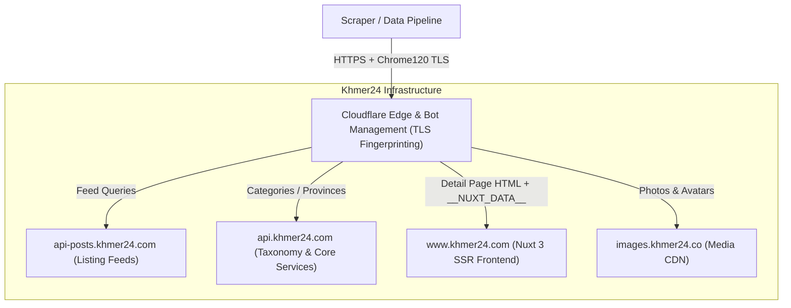
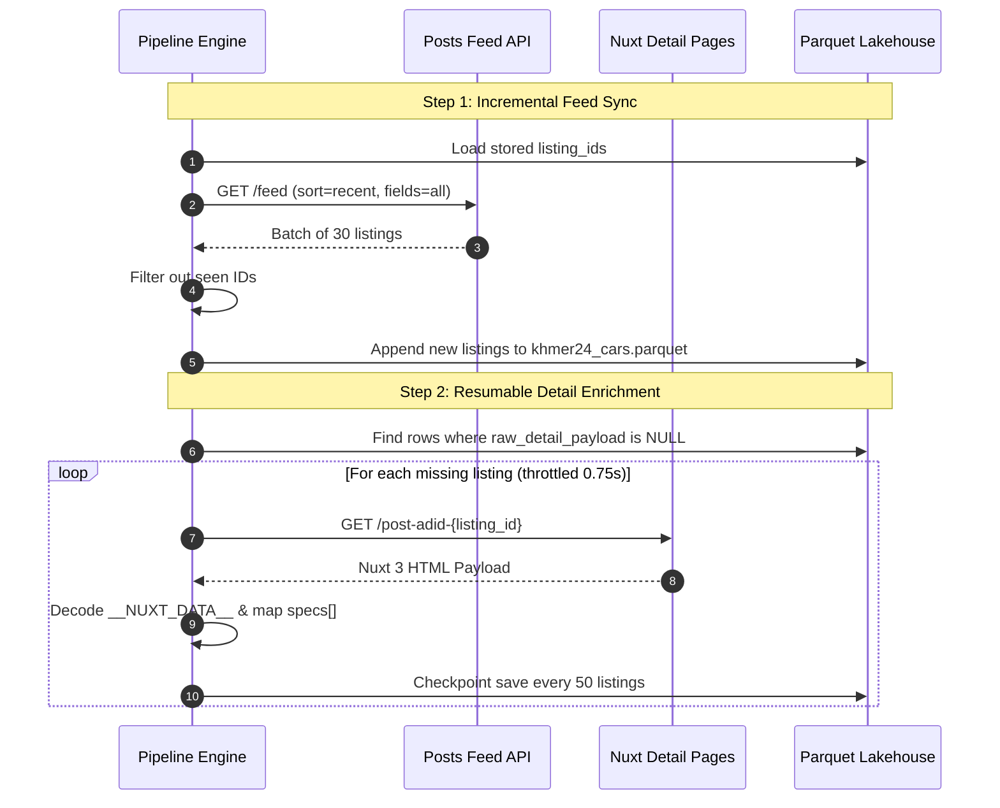

# Khmer24 Platform Architecture, Endpoints & Deep Crawling Guide

A comprehensive technical reference for the **Khmer24** classifieds platform, covering API infrastructure, hidden endpoints, anti-bot mechanisms, Nuxt 3 SSR devalue decoding, and production deep-crawling strategies.

---

## 1. 🌐 System Infrastructure & Topography

Khmer24 runs on a decoupled microservices architecture separated between mobile/public REST APIs, Nuxt 3 server-rendered frontend, and a geo-distributed media CDN.



### Domain Endpoints:
| Domain | Service Responsibility |
| :--- | :--- |
| **`https://api-posts.khmer24.com`** | High-throughput listing feeds, category search, and sorting. |
| **`https://api.khmer24.com`** | Core platform API (user authentication, categories, provinces/locations, store profiles). |
| **`https://www.khmer24.com`** | Nuxt 3 SSR web frontend rendering listing detail pages with embedded JSON state. |
| **`https://images.khmer24.co`** | Media asset delivery (vehicle photos, seller avatar images). |

---

## 2. 📡 API Endpoints Reference

### A. Feed & Search API
* **Endpoint**: `GET https://api-posts.khmer24.com/feed`
* **Purpose**: Primary pagination engine for listings across categories and provinces.

#### Query Parameters:
| Parameter | Type | Example | Description |
| :--- | :--- | :--- | :--- |
| `category` | `string` | `cars-for-sale` | Category slug identifier. |
| `province` | `string` | `phnom-penh` | Province slug (optional; omit for nationwide). |
| `offset` | `integer` | `0`, `30`, `60` | Pagination start index. |
| `limit` | `integer` | `30` | Items per page (standard: 30, max: 50). |
| `lang` | `string` | `en` or `km` | Localization language (`en` = English, `km` = Khmer). |
| `sort` | `string` | `recent`, `price_low`, `price_high` | Ordering method (`recent` is best for incremental sync). |
| `fields` | `string` | `all` | **Crucial**: Setting `fields=all` unlocks nested `user`, `location`, and `highlight_specs` objects. |
| `q` / `keyword` | `string` | `prius 2010` | Full-text title search query. |

#### Feed JSON Response Structure:
```json
{
  "status": "success",
  "total": 5840,
  "data": [
    {
      "id": 13784836,
      "title": "2024 COROLLA CROSS HEV",
      "price": "40900.00",
      "category": { "id": "67", "en_name": "Cars for Sale", "slug": "cars-for-sale" },
      "location": {
        "id": "32",
        "en_name": "Phnom Penh",
        "slug": "phnom-penh",
        "en_name2": "Ruessei Kaev, Phnom Penh",
        "en_name3": "Tuol Sangkae 1, Ruessei Kaev, Phnom Penh",
        "map": { "x": "11.56245", "y": "104.91601", "z": 15 }
      },
      "user": {
        "id": 519591,
        "name": "Tang Auto",
        "username": "TangMengSrunAuto",
        "user_type": "2",
        "photo": "https://images.khmer24.co/store/avatar.jpg",
        "is_verify": "1"
      },
      "storeid": "88321",
      "available": 1,
      "status": "active",
      "phone": ["012998785", "098729999"],
      "highlight_specs": [
        { "field": "car-year", "value": 2024 },
        { "field": "tax-type", "value": "Plate Number" }
      ],
      "photos": ["https://images.khmer24.co/26-08-12/car-1.jpg"],
      "posted_date": "2026-07-18 20:58:52",
      "views": 240
    }
  ]
}
```

---

### B. Detail Page Deep Extraction (`__NUXT_DATA__`)
* **URL Pattern**: `https://www.khmer24.com/post-adid-{listing_id}`
* **Format**: HTML response containing `<script id="__NUXT_DATA__">` JSON payload.

#### Why Detail Scraping Is Needed:
While the Feed API provides immediate access to price, model year, and location, the full vehicle specification table (mileage, engine displacement, transmission, fuel type, full Khmer description, and discount breakdown) lives inside the detail page state.

#### Embedded Specs Mapping:
| Nuxt Spec Field | Khmer Label | Target Schema Column | Parsed Format |
| :--- | :--- | :--- | :--- |
| `car-year` | `ឆ្នាំ` | `vehicle_model_year` | Integer (`2019`) |
| `condition` | `លក្ខខណ្ឌ` | `vehicle_condition` | Normalized String (`"used"`, `"new"`) |
| `tax-type` | `ប្រភេទពន្ធ` | `vehicle_tax_type` | Normalized String (`"plate number"`, `"tax paper"`) |
| `transmission` | `ប្រអប់លេខ` | `vehicle_transmission` | Normalized String (`"automatic"`, `"manual"`) |
| `color` | `ពណ៌` | `vehicle_color` | String (`"white"`, `"black"`, `"pearl"`) |
| `fuel` / `engine-type`| `ម៉ាស៊ីន` | `vehicle_fuel_type` | String (`"petrol"`, `"diesel"`, `"hybrid"`) |
| `mileage` / `odometer` | `ចម្ងាយ` | `vehicle_mileage_km` | Integer in km (`65000`) |
| `engine-size` | `ទំហំម៉ាស៊ីន` | `vehicle_engine_cc` | Integer in cc (`2500`) |

---

## 3. 🧩 Nuxt 3 Devalue Payload Decoding

Khmer24 uses Nuxt 3's **devalue serialization format**. In this format, JSON data is stored as a flattened array table where integers inside objects refer to other array indices.

```text
Payload array: [ "Toyota", "Camry", { "brand": 0, "model": 1, "year": 2020 } ]
Index 2 resolves to: { "brand": "Toyota", "model": "Camry", "year": 2020 }
```

### Devalue Resolution Algorithm (in [`car_price_prediction/parsers.py`](file:///c:/Users/Oudom/Desktop/life-os/programming-work/car-price-prediction/car_price_prediction/parsers.py#L174-L217)):
1. Locate `<script data-nuxt-data="nuxt-app" id="__NUXT_DATA__">` using regex.
2. Traverse the index tree recursively up to depth 60.
3. Memoize visited index nodes to prevent circular dependency infinite loops.
4. Extract the target dictionary containing `specs`, `title`, and `price`.

---

## 4. 🛡️ Anti-Bot & Cloudflare Bypass Protocols

Khmer24 protects its endpoints with Cloudflare Bot Management. Standard Python `requests` or `urllib` calls are blocked with HTTP 403.

### Required Bypass Settings:
1. **TLS Fingerprint Impersonation**:
   - Use `curl_cffi.requests.Session(impersonate="chrome120")` to emulate real Chrome 120 TLS ClientHello extensions and cipher suites.
2. **Mandatory Headers**:
   ```python
   DEFAULT_HEADERS = {
       "Accept": "application/json, text/plain, */*",
       "Accept-Language": "en-US,en;q=0.9",
       "Device-Id": "ds-intern-device-f4b8c10a",  # Rotatable UUID
       "display-type": "desktop",
       "Origin": "https://www.khmer24.com",
       "Referer": "https://www.khmer24.com/",
       "User-Agent": "Mozilla/5.0 (Windows NT 10.0; Win64; x64) AppleWebKit/537.36 (KHTML, like Gecko) Chrome/126.0.0.0 Safari/537.36",
   }
   ```
3. **HTTP 429 Backoff & Jitter**:
   - Parse `Retry-After` headers if returned.
   - Apply base exponential backoff: `5s` for HTTP 429, `1.5s` for transient 500s.
   - Respect a polite baseline delay (`0.75s` per request).

---

## 5. 🚀 Deep Crawling & Refresh Architecture



### Crawling Recommendations for Production:
1. **Feed Sync Frequency**: Daily cron at 03:00 UTC ([`.github/workflows/data-refresh.yml`](file:///c:/Users/Oudom/Desktop/life-os/programming-work/car-price-prediction/.github/workflows/data-refresh.yml)) collecting ~600 listings (20 pages).
2. **Detail Enrichment**: Run `enrich_details(raw_path, limit=200)` periodically in background workers with 50-item checkpointing.
3. **Deduplication Policy**: Re-scraped listings keep the newest record (`keep="last"`), capturing real-time price reductions by sellers.
